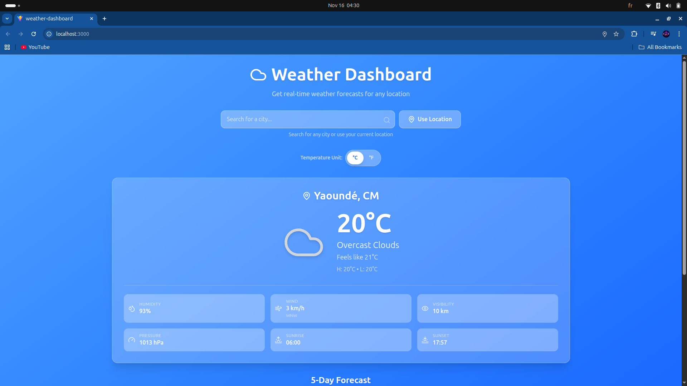
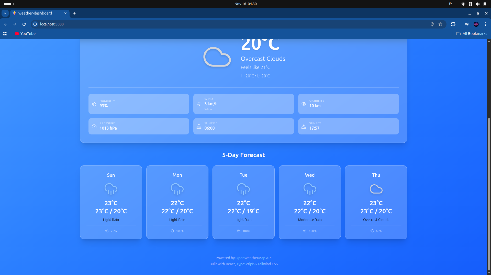

# React + TypeScript + Vite

This template provides a minimal setup to get React working in Vite with HMR and some ESLint rules.

Currently, two official plugins are available:

- [@vitejs/plugin-react](https://github.com/vitejs/vite-plugin-react/blob/main/packages/plugin-react) uses [Babel](https://babeljs.io/) (or [oxc](https://oxc.rs) when used in [rolldown-vite](https://vite.dev/guide/rolldown)) for Fast Refresh
- [@vitejs/plugin-react-swc](https://github.com/vitejs/vite-plugin-react/blob/main/packages/plugin-react-swc) uses [SWC](https://swc.rs/) for Fast Refresh

## React Compiler

The React Compiler is not enabled on this template because of its impact on dev & build performances. To add it, see [this documentation](https://react.dev/learn/react-compiler/installation).

## Expanding the ESLint configuration

If you are developing a production application, we recommend updating the configuration to enable type-aware lint rules:

# 🌤️ Weather Dashboard

> A stunning, real-time weather forecasting application built with cutting-edge web technologies. Get instant weather updates for any location on Earth!

## 🚀 Features

- **🔍 Smart City Search** - Find weather for any city worldwide with intelligent autocomplete
- **📍 Geolocation Support** - One-click weather lookup for your current location
- **🌡️ Dual Temperature Units** - Toggle between Celsius and Fahrenheit with instant conversions
- **📅 5-Day Forecast** - Plan ahead with detailed daily weather predictions
- **🎨 Beautiful UI** - Glassmorphic design with smooth animations and responsive layout
- **⚡ Lightning-Fast** - Powered by Vite for instant HMR and blazing-fast builds
- **🛡️ Type-Safe** - Full TypeScript support with strict type checking

## 📸 Screenshot





---

## 🛠️ Tech Stack

| Technology             | Purpose                |
| ---------------------- | ---------------------- |
| **React 19**           | UI framework           |
| **TypeScript**         | Type-safe development  |
| **Vite**               | Ultra-fast build tool  |
| **Tailwind CSS v4**    | Utility-first styling  |
| **Lucide React**       | Beautiful icons        |
| **date-fns**           | Date formatting        |
| **OpenWeatherMap API** | Real-time weather data |

## 🎯 Getting Started

### Prerequisites

- Node.js 18+
- npm or yarn

### Installation

1. **Clone the repository**

   ```bash
   git clone https://github.com/kyler004/weather-dashboard.git
   cd weather-dashboard
   ```

2. **Install dependencies**

   ```bash
   npm install
   ```

3. **Set up environment variables**

   ```bash
   cp .env.example .env
   ```

   Then edit `.env` and add your [OpenWeatherMap API key](https://openweathermap.org/api):

   ```env
   VITE_WEATHER_API_KEY=your_api_key_here
   VITE_WEATHER_API_URL=https://api.openweathermap.org/data/2.5
   ```

4. **Start the development server**

   ```bash
   npm run dev
   ```

   The app will automatically open at `http://localhost:3000`

## 📝 Available Scripts

```bash
# Start development server with hot reload
npm run dev

# Build for production
npm run build

# Run ESLint
npm run lint

# Preview production build locally
npm run preview
```

## 💻 Project Structure

```
src/
├── components/          # Reusable React components
│   ├── SearchBar.tsx    # City search input
│   ├── CurrentWeather.tsx # Current conditions display
│   ├── ForecastList.tsx # 5-day forecast cards
│   └── UnitToggle.tsx   # Temperature unit switcher
├── hooks/
│   └── useWeather.ts    # Custom weather data hook
├── services/
│   └── weatherService.ts # OpenWeatherMap API integration
├── types/
│   └── weather.ts       # TypeScript type definitions
├── utils/
│   ├── converter.ts     # Temperature & unit conversions
│   └── formatters.ts    # Date & time formatting
├── App.tsx              # Main application component
└── main.tsx             # Entry point
```

## 🔑 Key Code Examples

### Fetching Weather by City

```typescript
import { getWeatherByCity } from "@/services/weatherService";

const fetchWeather = async () => {
  try {
    const { current, forecast } = await getWeatherByCity("London", "celsius");
    console.log(`Current: ${current.temperature}°C`);
    console.log(`Forecast days: ${forecast.length}`);
  } catch (error) {
    console.error("Weather fetch failed:", error.message);
  }
};
```

### Using the Weather Hook

```typescript
import { useWeather } from "@/hooks/useWeather";

export function MyComponent() {
  const { weatherData, fetchWeatherByCity, toggleUnit } = useWeather();

  const { current, forecast, unit, loading, error } = weatherData;

  return (
    <div>
      {loading && <p>Loading...</p>}
      {error && <p>Error: {error}</p>}
      {current && (
        <>
          <h2>{current.cityName}</h2>
          <p>
            {current.temperature}°{unit === "celsius" ? "C" : "F"}
          </p>
          <button onClick={toggleUnit}>Switch Units</button>
        </>
      )}
    </div>
  );
}
```

### Temperature Conversion

```typescript
import {
  kelvinToCelsius,
  celsiusToFahrenheit,
  getUnitSymbol,
} from "@/utils/converter";

const tempKelvin = 288.15;
const celsius = kelvinToCelsius(tempKelvin); // 15°C
const fahrenheit = celsiusToFahrenheit(celsius); // 59°F
const symbol = getUnitSymbol("celsius"); // °C
```

## 🌍 API Integration

This project uses the **OpenWeatherMap API** for real-time weather data:

- **Current Weather** - Get instant conditions for any location
- **5-Day Forecast** - Plan ahead with daily predictions
- **Geocoding** - Search cities by name and get coordinates

Get your free API key at [openweathermap.org/api](https://openweathermap.org/api)

## 🎨 Styling Features

The dashboard features:

- **Glassmorphic Cards** - Frosted glass effect with backdrop blur
- **Smooth Animations** - Hover effects and transitions
- **Responsive Design** - Works beautifully on mobile, tablet, and desktop
- **Custom Gradients** - Stunning blue gradient background
- **Dark Mode Ready** - Light text on dark background

```css
/* Example: Glass card effect */
.glass-card {
  @apply bg-white/20 backdrop-blur-lg;
  @apply border border-white/30;
  @apply shadow-xl rounded-2xl;
}
```

## 🚀 Performance

- **Instant Hot Module Replacement (HMR)** with Vite
- **Code Splitting** - Automatic chunk splitting for optimized bundles
- **API Caching** - Smart caching to reduce API calls
- **Lazy Loading** - Components load only when needed

## 📱 Browser Support

- Chrome/Edge 90+
- Firefox 88+
- Safari 14+
- Mobile browsers (iOS Safari, Chrome Mobile)

## 🐛 Troubleshooting

**Missing API Key Error?**

```
Error: Missing VITE_WEATHER_API_KEY environment variable.
Please set it in your .env file.
```

Solution: Add your API key to `.env`

**Geolocation not working?**

- Check browser permissions for location access
- Use HTTPS (required for geolocation in production)
- Verify your browser supports Geolocation API

**Build fails?**

```bash
# Clear cache and reinstall
rm -rf node_modules
npm install
npm run build
```

## 📄 License

MIT © 2025 Kyler

## 🤝 Contributing

Contributions are welcome! Feel free to open issues or submit pull requests.

## 🙏 Acknowledgments

- [OpenWeatherMap](https://openweathermap.org/) - Weather data
- [React](https://react.dev/) - UI library
- [Tailwind CSS](https://tailwindcss.com/) - Styling
- [Vite](https://vitejs.dev/) - Build tool

---

**Made with ❤️ using React, TypeScript & Tailwind CSS**

You can also install [eslint-plugin-react-x](https://github.com/Rel1cx/eslint-react/tree/main/packages/plugins/eslint-plugin-react-x) and [eslint-plugin-react-dom](https://github.com/Rel1cx/eslint-react/tree/main/packages/plugins/eslint-plugin-react-dom) for React-specific lint rules:

```js
// eslint.config.js
import reactX from "eslint-plugin-react-x";
import reactDom from "eslint-plugin-react-dom";

export default defineConfig([
  globalIgnores(["dist"]),
  {
    files: ["**/*.{ts,tsx}"],
    extends: [
      // Other configs...
      // Enable lint rules for React
      reactX.configs["recommended-typescript"],
      // Enable lint rules for React DOM
      reactDom.configs.recommended,
    ],
    languageOptions: {
      parserOptions: {
        project: ["./tsconfig.node.json", "./tsconfig.app.json"],
        tsconfigRootDir: import.meta.dirname,
      },
      // other options...
    },
  },
]);
```
